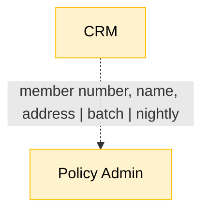

# Flow Mapping Skill

## Purpose

Turn current-state data-flow findings into Mermaid diagrams that **compile, read clearly, and state
their own maturity** — then iterate on them until they do. A flow map is not decoration: it is the
artifact stakeholders argue with. A diagram that renders but hides its cadence, its reliability, or
its evidence is worse than no diagram, because it looks authoritative while asserting nothing.

The skill pairs a **deterministic validator** (compilation + structural lints) with an **LLM review
pass** (judgement). The split matters: regex settles what is decidable, so the model's attention is
spent only on what needs a reader's judgement.

## When to Use

Use this skill when:
- A data-flow / system-map / integration-map deliverable needs diagrams
- Existing diagrams need to be checked before publication (they may not even compile)
- Current-state flows must be shown per domain (Sales, Policy, Underwriting, Claims, ...)
- Prose describes flows that nobody has drawn, so contradictions stay invisible
- A pipeline emits flows as `{source, target, transformation}` triples and needs them rendered

Do **not** use it for future-state architecture proposals — this skill asserts what *is*, evidenced.

## Input

**Source:** flow findings in any of these shapes
- `data-flow` / `system-map` / `integration-map` deliverables (`.json` or `.md`) produced *outside* this pipeline — by a discovery engagement, an integration inventory, or an interview-analysis tool
- flow triples: `[{name, source, target, transformation}, ...]`
- interview evidence describing how data moves
- from inside the pipeline: `.gener8v/context.md` (external integrations, Brownfield Phase 2) and `.gener8v/brownfield/reconnaissance.md` (side effects per file)

**Expects:** at minimum a source, a target, and what moves between them. Cadence, mechanism, and
reliability are what the skill exists to force into the open — their absence is a finding, not a
blocker.

## Output

**Writes to:** `.gener8v/flows/[domain-slug].md` (one file per domain), each containing:
- a short prose statement of the domain's current-state flow
- one or more Mermaid diagrams
- an explicit **Unknowns** list — what could not be evidenced

**Gate:** `scripts/validate-flows.sh` (next to this SKILL.md) must exit 0 before the artifact is considered done. Its path depends on how the skills are installed:
- plugin: `"${CLAUDE_PLUGIN_ROOT}/skills/flow-mapping/scripts/validate-flows.sh"`
- copied skills: `~/.claude/skills/flow-mapping/scripts/validate-flows.sh`

The session's working directory is the user's project, so a relative `scripts/…` never resolves — always use one of the two forms above.

## Output Format

````markdown
# [Domain] — Current-State Data Flow

## How data moves today
[Prose: the flow in plain language, naming systems and the humans in the loop.]



## Reliability
| Node/Flow | Class | Why |
|---|---|---|
| CRM → Policy Admin | fragile | Nightly batch; date of birth silently dropped |

## Unknowns
- [What the evidence does not establish — named, not smoothed over.]
````

## Principles

1. **Compilation is non-negotiable.** A diagram that does not render is not a deliverable. Gate it
   mechanically (`mmdc` exits 1 on a parse error); never eyeball it.
2. **Every edge states its payload.** `A --> B` asserts nothing. Say *what* moves, *how*, and *how
   often*: `-. "member number | batch | nightly" .->`.
3. **Reliability is part of the model, not a footnote.** Use the four classes — `reliable`,
   `fragile`, `broken`, `isolated`. An unclassed node is an unasked question.
4. **`isolated` means deliberately unconnected.** An isolated store with no edges *is* the finding
   (nothing reads or writes it). Do not "fix" it by inventing an edge, and do not lint it as an
   orphan.
5. **Evidence or unknown — never plausible.** A flow nobody described does not go in the diagram
   because it would be tidy. It goes in **Unknowns**.
6. **One domain per diagram.** Past ~18 nodes a graph stops being read and starts being admired.
   Split by domain and link.
7. **Contradiction is signal.** When IT and field staff describe the same flow differently, draw
   both and mark the conflict. Averaging them destroys the finding.
8. **Regex first, model second.** Do not spend an LLM call on what a lint decides.

## Process

1. **Collect** flows from the source deliverable/evidence. Group by domain.
2. **Draft** one diagram per domain in the Output Format above.
3. **Validate (mechanical):**
   ```bash
   "${CLAUDE_PLUGIN_ROOT}/skills/flow-mapping/scripts/validate-flows.sh" .gener8v/flows/*.md
   # copied install: ~/.claude/skills/flow-mapping/scripts/validate-flows.sh .gener8v/flows/*.md
   ```
   Fix every `ERROR` (compilation, no nodes). Treat each `WARN` as a question to answer, not noise
   to silence — an unlabelled edge usually means the evidence never said what moves.
4. **Review (judgement)** — the LLM pass, on what the lint cannot decide:
   - **Clarity:** would a stakeholder who was *not* in the interviews read this the way we mean?
     Are labels domain language, or our shorthand? Is direction consistent?
   - **Maturity:** is each class assignment defensible from evidence? Is cadence real or assumed?
     Are the humans in the loop drawn, or silently abstracted into a system box?
   - **Fidelity:** does the diagram claim anything the evidence does not support? Anything in the
     prose that is missing from the diagram (or vice versa)?
5. **Iterate** 3–4 until validation is clean and review raises nothing new. Record what changed.
6. **Report** unresolved conflicts and Unknowns — they are output, not failure.

## Example

**Input triple**
```json
{"name": "member sync", "source": "CRM", "target": "PolicyAdmin",
 "transformation": "nightly batch; date of birth dropped"}
```

**Draft (fails)**
```
graph TD
  CRM --> PolicyAdmin
```
`validate-flows.sh` → `WARN 1/1 edge(s) unlabelled`, `WARN no classDef`, `WARN no cadence`.
It compiles, so it looks finished — and asserts nothing.

**After iteration**
```
graph TD
    classDef fragile fill:#fff3cd,stroke:#ffc107,color:#000
    CRM["CRM"]
    PolicyAdmin["Policy Admin"]
    class CRM fragile
    class PolicyAdmin fragile
    CRM -. "member number, name, address | batch | nightly" .-> PolicyAdmin
```
Now it says: this is a batch flow, it runs nightly, it is fragile, and here is exactly what crosses.
The date-of-birth loss surfaces in **Reliability** and drives a finding.

## Integration with Other Skills

- **Upstream:** discovery deliverables from outside the pipeline; inside it, Brownfield's `context.md` and
  `brownfield/reconnaissance.md`.
- **Technical Design:** reads `.gener8v/flows/*.md` as the current-state baseline any target-state design
  must move from.
- **Brownfield:** flow maps are evidence for capability boundaries (Phase 3).
- **Specification:** Unknowns become open questions.
- **Orchestrate:** lists flow maps under `cross_cutting.flows`; Audit checks them (compilation, Unknowns
  present, every edge labelled).

## Revisions

- Re-run when new evidence arrives (an interview, a discovered integration) or when a flow's cadence,
  mechanism or reliability changes; a diagram is current-state and dates quickly — record the evidence
  date in the prose.
- Re-validate after any edit: the gate is cheap and a diagram that stops compiling is worse than none.
- Flow maps are standalone artifacts: they are not invalidated by PRD or specification changes.

## Notes

- The validator needs `npx` (Node). It fetches `@mermaid-js/mermaid-cli@11` on first run (network access,
  ~30 s); when `npx` is absent it says so and exits 2 rather than reporting a compile failure.
- `MAX_NODES` (default 18) tunes the split threshold: `MAX_NODES=24 validate-flows.sh ...`.
- The four `classDef` colors are the house convention; keep them stable so diagrams read the same across
  projects.
- Exit codes: `0` all diagrams compile and no ERROR lints; `1` otherwise; `2` bad usage.
